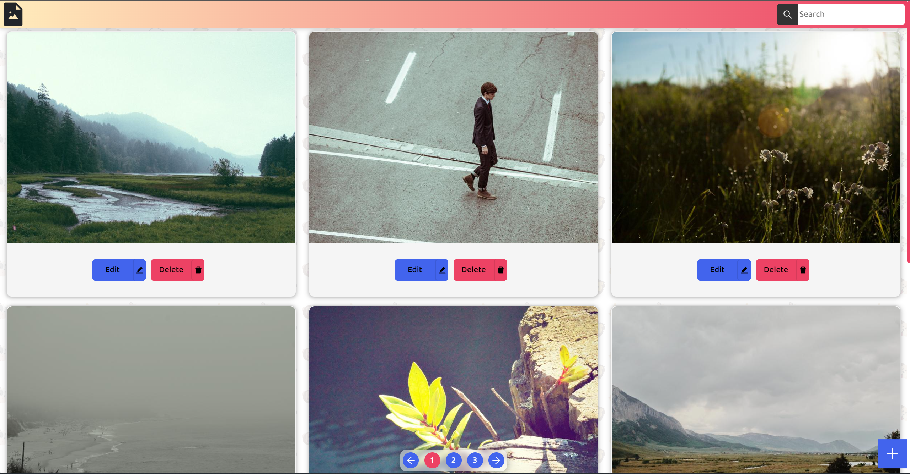
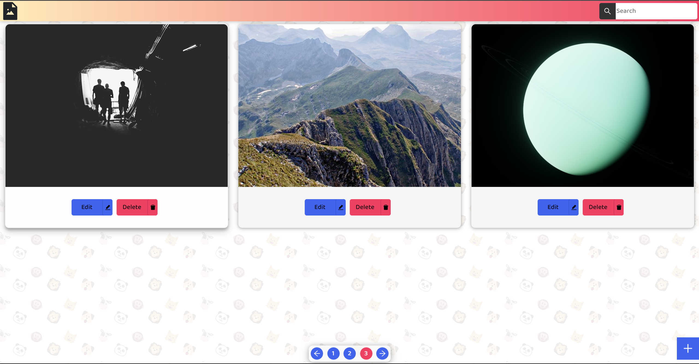
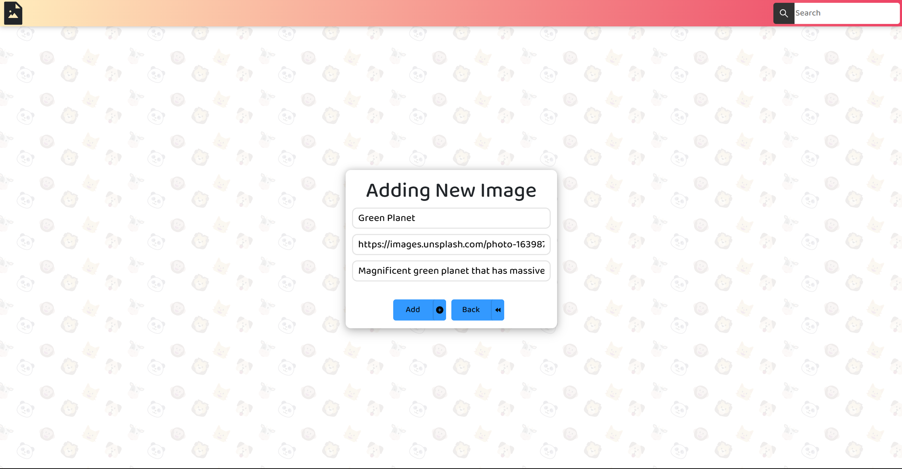
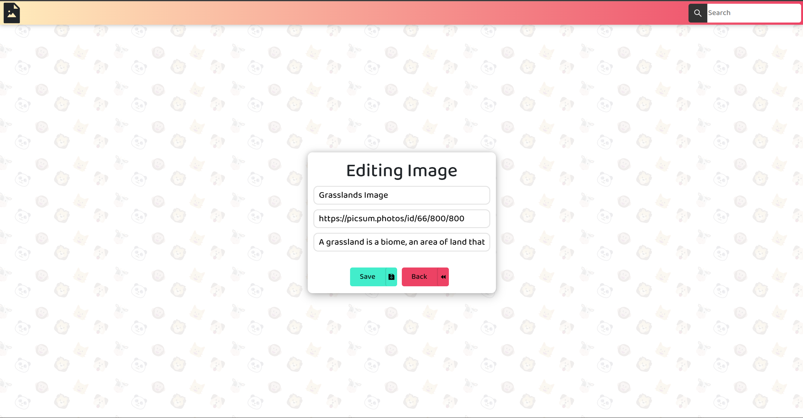
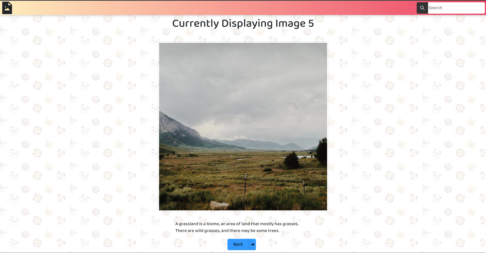

# hackerearth-assesment

You can see the live application [here](https://hackerearth-assesment.herokuapp.com/).

# Instructions

Follow the instructions given below to run the app in development mode.

### Get the dependencies

```bash
npm install && cd frontend && npm install && cd ..
```

### Provide MongoDB URI

Create a file named `.env` in the root directory of the project.
Add the following lines to the file:
```
DATABASE_URI=mongodb://localhost:27017/imagedb
```

### Run the app

```bash
npm run dev && cd frontend && npm start
```

### Seed the database

```bash
npm run seed
```

### Run the tests

```bash
cd frontend && npm test
```

# Tech Stack

Below is the tech stack used to build the app.

### Frontend

* React
    * react-router
    * react-bootstrap
    * react-icons
    * react-paginate
* Bootstrap

### Backend

* Express
    * body-parser
    * method-override
    * mongoose
* MongoDB


# ScreenShots


<p align="center">Home Route</p>

<p align="center">Pagination</p>

<p align="center">Add Route</p>

<p align="center">Edit Route</p>

<p align="center">Show Route</p>
